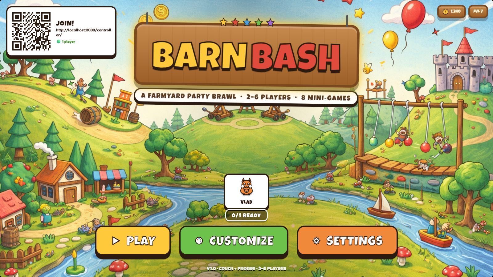
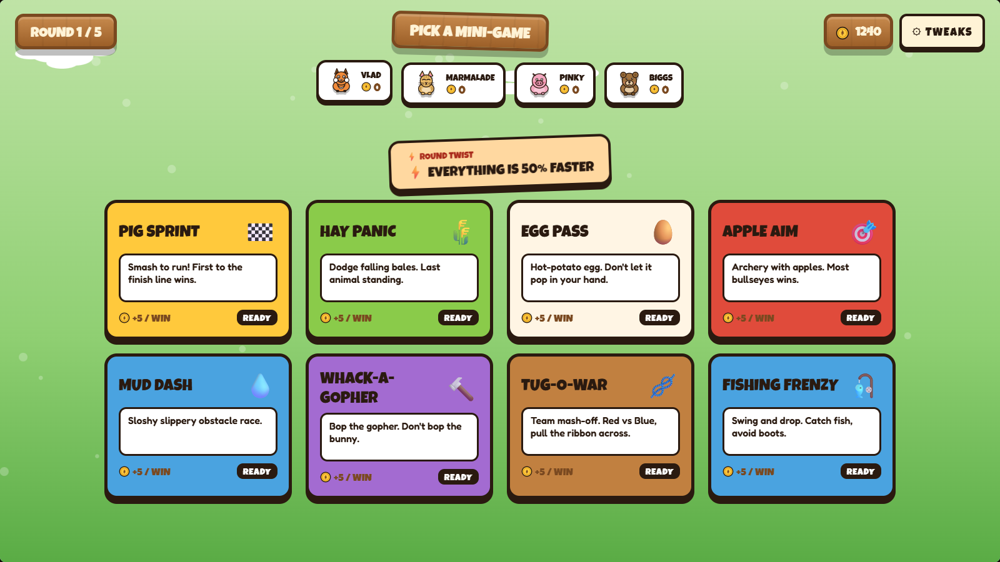
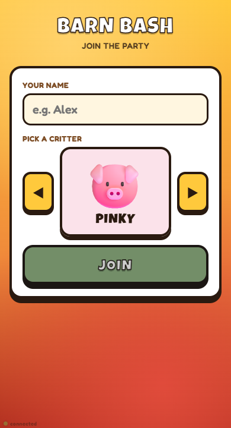
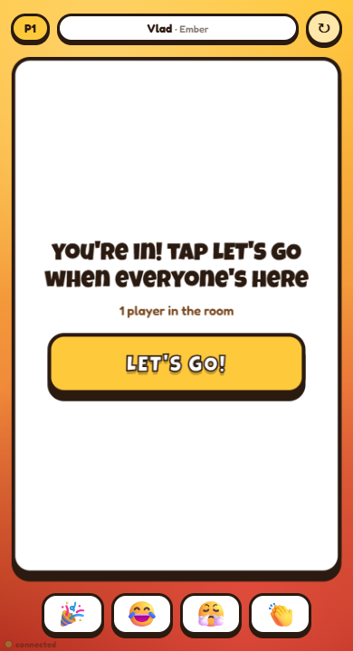
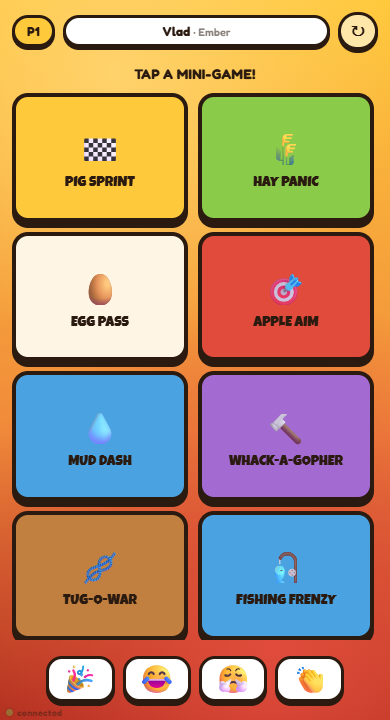

# Barn Bash

A 2D farmyard party-game prototype you play on the couch with a laptop
(the "host") and up to six friends joining from their phones. Eight
mini-games, 2-6 players, round twists, live scoreboard, emoji reactions,
and a full Jackbox-style auto-advance flow — nobody has to touch the
host keyboard once the first PLAY is pressed.



## Run

```
node server.js
```

Then:
- Host TV: open `http://localhost:3000/` on the couch laptop.
- Phones: scan the QR in the top-left corner or visit
  `http://<your-lan-ip>:3000/controller/`.

React 18 + Babel are loaded in-browser via unpkg, so there is nothing
to build — just serve the static files.

## How it plays

1. Host loads the title screen; phones join the room by scanning the QR.
2. Each phone picks a critter from an emoji carousel and taps `LET'S GO!`.
3. Once everyone's in, the host auto-advances into Character Select →
   Minigame Board → one of eight mini-games → per-round Scoreboard →
   back to Board for the next round → final Podium.
4. Between rounds, phones tap `TAP WHEN READY`; the host advances the
   moment the last phone confirms. At the podium, phones tap
   `TAP FOR REMATCH` and a new game starts with the same lineup.
5. `TWEAKS` panel on the host lets you change difficulty, total rounds,
   palette, twist modifiers, and the total player count — phones fill
   the lineup first, CPU critters fill the rest up to the target, so
   any mix works: 6 phones + 0 CPU, 2 phones + 2 CPU, 1 solo + 3 CPU.

### Host TV — Minigame Board

Four players (one phone, three CPUs) line up at the top; the eight
mini-game tiles are the main event. Phones can vote by tapping a tile;
once every connected phone has voted, the host auto-picks the winner.
Round twists like "EVERYTHING IS 50% FASTER" shake up the rules.



### Phone controller — pick a critter



### Phone controller — lobby + board vote

Each phone sees a per-screen view driven by host broadcasts: a lobby
between screens, a `LET'S GO!` / `TAP WHEN READY` button whenever the
host is waiting on phone confirmation, and per-minigame input pads
(tap, steer, holes). A reaction bar floats emoji onto the host TV.

<p align="center">
  
  &nbsp;&nbsp;
  
</p>

## Layout

```
index.html                — root HTML, loads React + Babel + src/*.jsx
src/app.jsx               — top-level App, screen state, stage scaling,
                            palette tinting, tweaks panel host
src/characters.jsx        — SVG character art (Pig / Fox / Bear / …)
src/common.jsx            — shared widgets (Clouds, Coin, Confetti,
                            Sparkle, BackgroundPainting, …)
src/screens.jsx           — TitleScreen / CharacterSelect / BoardScreen /
                            Scoreboard / Podium
src/minigames.jsx         — Pig Sprint, Hay Panic
src/minigames2.jsx        — Apple Aim, Whack-a-Gopher
src/minigames3.jsx        — Egg Pass, Mud Dash
src/minigames4.jsx        — Tug-o-War, Fishing Frenzy
src/multiplayer.jsx       — WebSocket host hook + QR overlay
src/tweaks.jsx            — in-page tweaks panel
client-controller/        — phone controller (index.html + controller.jsx)
server.js                 — static file server + WebSocket relay
assets/bg.png             — painted barnyard scene (title + subtle
                            in-game watermark)
```

## Multiplayer architecture

- `server.js` is a thin broker: it serves the static files and relays
  messages between the single host connection and N phone controllers.
  Controllers get a stable integer `playerId` that survives reloads via
  a `clientId` saved in the controller's `localStorage`.
- The host (`/`) owns authoritative game state and broadcasts screen
  transitions, mini-game start/end, live scores, turn updates, round
  ends, and game-over finale payloads back to every connected phone.
- Phones (`/controller/`) render a per-minigame input contract driven
  by those broadcasts — tap pad, three-button steer pad, 3×2 holes
  grid, board-vote grid, ready-ups, reactions, character swap.

## History

This repository previously housed a live multiplayer Frantics stack
(Node WebSocket server, four per-game hosts, painted lobby / tournament
/ post-game heros). It was reset to the Barn Bash prototype on
2026-04-19. The prior state is preserved under the
`pre-reboot-2026-04-19` git tag; any commissioned art or design spec
can be recovered via `git show pre-reboot-2026-04-19:<path>` or
`git checkout pre-reboot-2026-04-19 -- <path>`.
